# My Activity On Slack

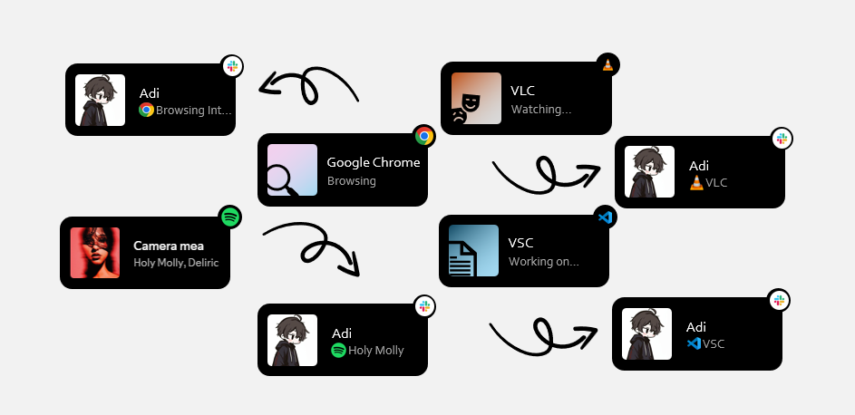

- A simple Python app that sinks your activity with you Slack status!

Watch on [Youtube](https://www.youtube.com/watch?v=rLFpijAMtlY)

- First download the app from releases !

### Get Slack Token 

- Go to [Slack Aps](https://api.slack.com/apps)

- Click Create New App -> From scratch

- Give it a name (status)

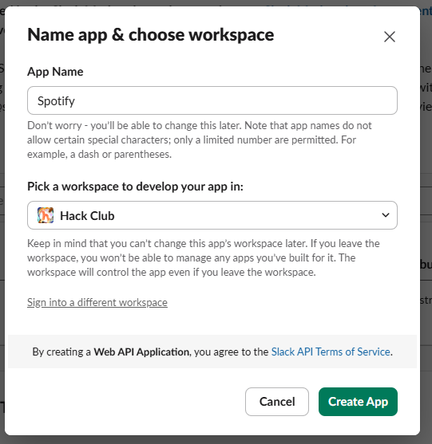

- Now go to the OAuth & Permissions
- Scroll to User Token Scopes and add `users.profile:write`

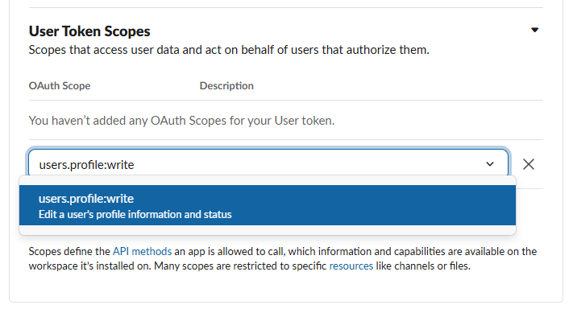

- Now go to the start of the page and click Install to workspace -> Allow

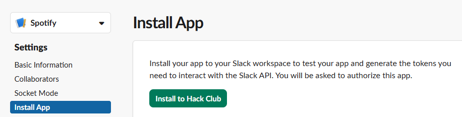

- Copy User OAuth Token

- Go to: [Spotify Developer Dashboard](https://developer.spotify.com/dashboard)

- Login to your Spotify Account if you aren't logged 

- Accept the TOS

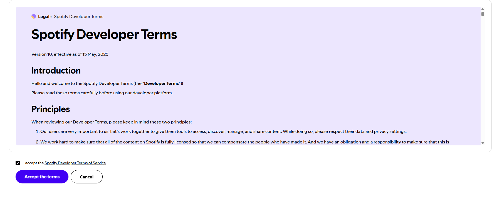

- Now click on the Create App button

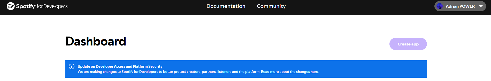

 - Put a name (slack-status)
 - Redirect URI: http://127.0.0.1:9090/callback
 - Check WEB API

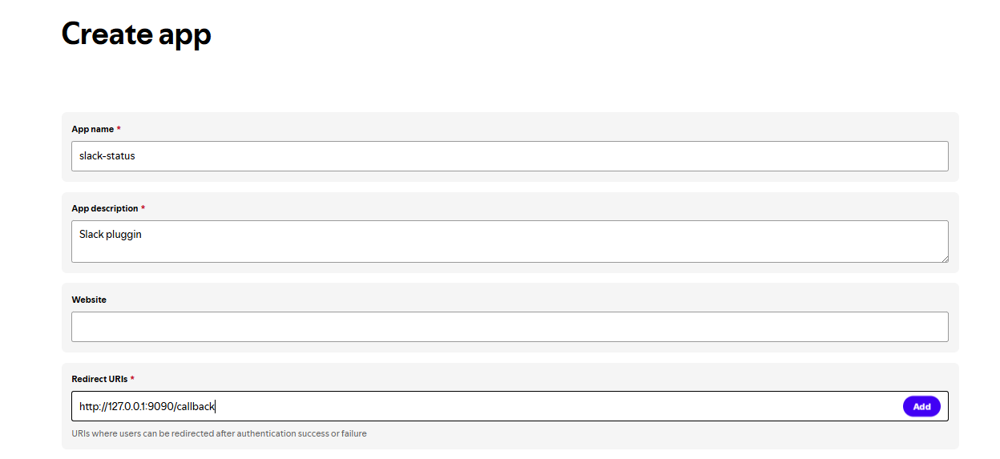

- After that go to the app settings and copy CLIENT ID and CLIENT SECRET

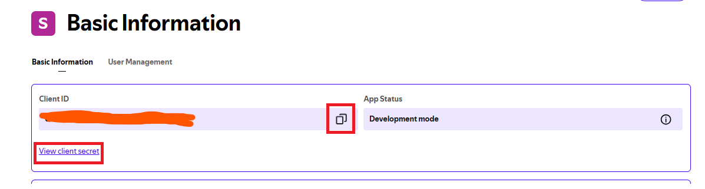

- You can config other apps too just click on the add button on the section "Other Aps"
- You can also arrange the priority order from the right top of the item

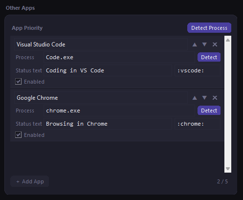

- After you create a new entery here just give it a name

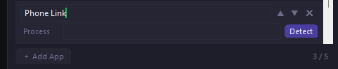

- Then choose a status text and an emoji 

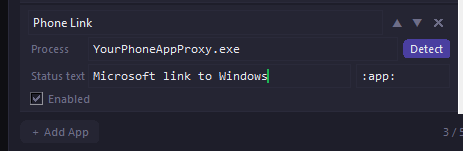

- Now click detect process and choose the app process

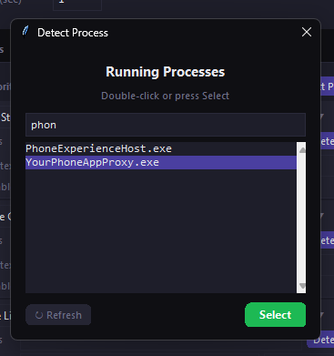

- Please note that if you OAuth Spotify, Spotify has priority of showing

- To sync your status on Slack, you need to paste the codes we discussed into the app

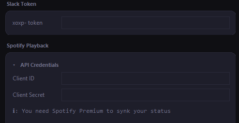

- This app uses less then 50MB RAM

!!! All logos for other apps belong to their respective developers and are not owned by me, such as the logos for: Spotify, VSC, VLC, Chrome, Slack !!!

