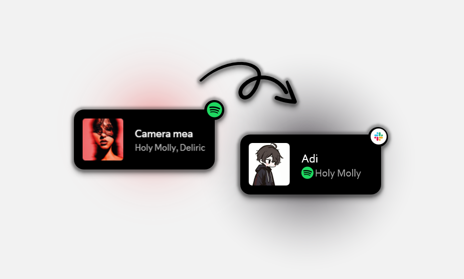
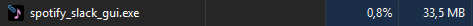

# Spotify Status On Slack

- A simple Python app that sinks your Spotify playback with you Slack status!

# Resource Usage

- This app was made and designed in Python with tKinter GUI and does use only ~35 MB RAM; 0,6 CPU.

# Guide

- This guide will help you setup the app properlly
- You need spotify premium to make this work

1. Spotify API
- Go to: [Spotify Developer Dashboard](https://developer.spotify.com/dashboard)
- Login to your Spotify Account if you aren't logged 
- Accept the TOS
- Now click on the Create App button
    - Put a name (slack-status)
    - Redirect URI: http://127.0.0.1:9090/callback
    - Check WEB API
- After that go to the app settings and copy CLIENT ID and CLIENT SECRET

2. Slack 
- Go to [Slack Aps](https://api.slack.com/apps)
- Click Create New App -> From scratch
- Give it a name (spotify-status)
- Now go to the OAuth & Permissions
- Scroll to User Token Scopes and add `users.profile:write`
- Now go to the start of the page and click Install to workspace -> Allow
- Copy User OAuth Token

3. App Config 
- Now that you have all this codes just paste them in the app, auth Spotify, and you should be good to go

